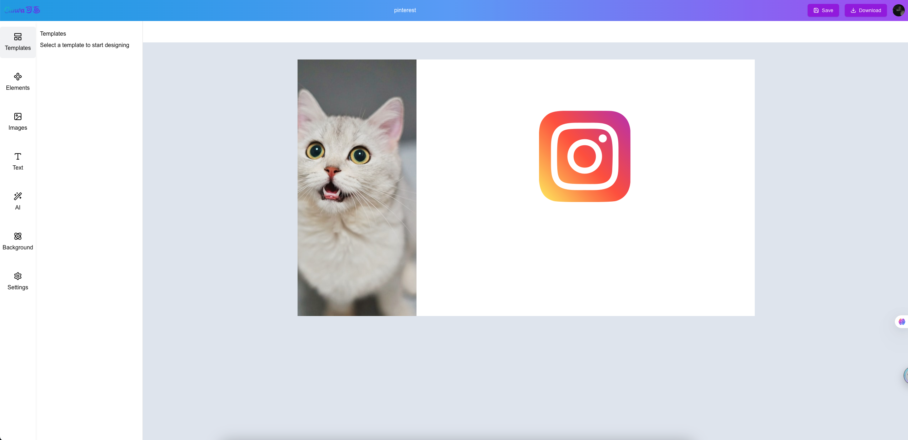
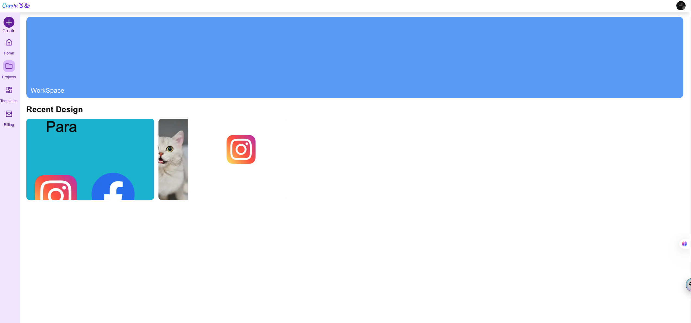
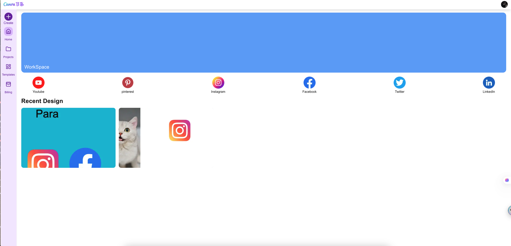

# Bubble AI Canvas


Bubble AI Canvas 是一个现代化的在线设计平台，集成了强大的 AI 图片处理能力和专业的设计工具。通过直观的拖拽操作和智能的 AI 辅助功能，让设计创作变得简单高效。

## 📸 核心功能展示

### 专业设计工作区
强大而直观的设计界面，支持多种设计元素和智能工具


### 项目管理与模板中心
便捷的项目管理系统，快速开始新设计


### 简洁现代的界面
清爽直观的用户界面，让设计过程更加流畅


## ✨ 核心功能

### 🤖 AI 智能工具集
- **智能抠图**：一键移除任意图片背景
- **智能补全**：使用 AI 技术填充缺失区域
- **智能放大**：提升图片分辨率，优化清晰度
- **背景替换**：智能更换图片背景
- **自动优化**：一键优化图片色彩和对比度

### 🎨 专业设计工具
- **画布编辑**
  - 自由拖拽：灵活调整元素位置和大小
  - 图层控制：自由调整元素层级和对齐
  - 快捷操作：支持复制、删除、组合等操作
  - 历史记录：支持撤销和重做
  
- **样式编辑**
  - 文字美化：丰富的字体库和文本样式
  - 图形工具：基础形状和自定义SVG支持
  - 视觉效果：边框、阴影、透明度、圆角等
  - 滤镜应用：内置多种图片滤镜效果

### 📦 资源管理系统
- **模板系统**：内置多种设计模板，一键应用
- **项目管理**：分类保存设计作品，快速查找
- **本地存储**：自动保存设计进度，防止丢失
- **导出分享**：支持多种格式导出成品

## 🛠️ 技术栈

### 核心技术
- [Fabric.js](http://fabricjs.com/) — 强大的 HTML5 Canvas 库，提供完整的画布交互能力
- [Next.js 14](https://nextjs.org/) — React 服务端渲染与静态网站生成框架
- [TypeScript](https://www.typescriptlang.org/) — 类型安全的 JavaScript 超集

### UI 和样式
- [Tailwind CSS](https://tailwindcss.com/) — 实用优先的 CSS 框架
- [Radix UI](https://www.radix-ui.com/) — 无样式、可访问的 UI 组件
- [Geist Font](https://vercel.com/font) — 现代无衬线字体

### 状态管理和数据
- [Zustand](https://zustand-demo.pmnd.rs/) — 轻量级状态管理
- [Convex](https://convex.dev/) — 实时数据库与后端服务

### 图片处理
- [ImageKit](https://imagekit.io/) — 图片处理和 CDN 服务
- [react-color](https://casesandberg.github.io/react-color/) — 颜色选择器组件

## 🔧 系统要求

- Node.js 18.0.0 或更高版本
- npm 或 yarn 包管理器
- 现代浏览器（Chrome、Firefox、Safari、Edge 等）

## 📁 目录结构

```
├── app/                # Next.js 应用主目录
│   ├── (routes)/       # 路由页面与子模块
│   ├── assets/         # 静态图片与素材
│   ├── fonts/          # 字体文件
│   └── ...
├── components/         # 通用 UI 组件
├── containers/         # 业务功能组件
├── constants/          # 常量与配置
├── convex/             # Convex 数据库相关
├── hooks/              # 自定义 React Hooks
├── lib/                # 工具库与第三方集成
├── store/              # 状态管理
├── public/             # 公共资源
├── README.md           # 项目说明文档
└── ...
```

## 🚀 快速开始

1. **安装依赖**

```bash
npm install
# 或者
yarn install
```

2. **启动开发服务器**

```bash
npm run dev
# 或 yarn dev / pnpm dev / bun dev
```

3. 打开浏览器访问 [http://localhost:3000](http://localhost:3000)

4. 开始编辑页面：修改 `app/page.tsx` 或相关组件，页面会自动热更新。

## 🖼️ 部署

推荐使用 [Vercel](https://vercel.com/) 一键部署：

- 点击 [Vercel 部署链接](https://vercel.com/new?utm_medium=default-template&filter=next.js&utm_source=create-next-app&utm_campaign=create-next-app-readme)
- 或参考 [Next.js 部署文档](https://nextjs.org/docs/app/building-your-application/deploying)

## 🤝 贡献指南

欢迎任何形式的贡献！

1. Fork 本仓库
2. 新建分支 (`git checkout -b feature/your-feature`)
3. 提交更改 (`git commit -am 'Add new feature'`)
4. 推送分支 (`git push origin feature/your-feature`)
5. 提交 Pull Request

## 📚 相关资源

- [Next.js 官方文档](https://nextjs.org/docs)
- [Convex 官方文档](https://docs.convex.dev/)
- [Tailwind CSS 文档](https://tailwindcss.com/docs)
- [Geist 字体](https://vercel.com/font)

## 📄 License

本项目基于 MIT License 开源。

---

如有问题或建议，欢迎提 Issue 或联系作者。
